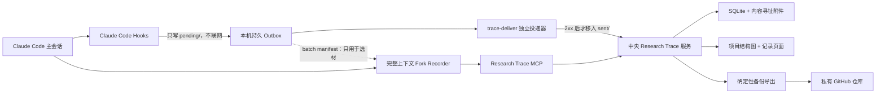

# Research Trace

Research Trace 是一个面向科研与长期项目开发的 **Agent 工作记忆系统**。

它保存 Claude Code 能看到的完整对话、工具调用和子 Agent 历史，同时让一个受限的
Recorder 只把真正有长期价值的内容整理成简洁、可纠正、可搜索的项目记录。

它记录的不只是“实验”。论文搜索、想法讨论、数据理解、失败方案、关键代码实现、指标、
图片、产物路径和阶段性结论，都可以成为项目知识的一部分。

## 为什么做这个项目

研究过程很少是一份整齐的实验表：一次对话可能先查论文，再检查数据，随后尝试代码，
发现方向不成立，又回到新的假设。只保存最终结果，会丢掉大量以后仍然有价值的信息；
完整保存所有聊天，又会迅速变成无法阅读的日志堆。

Research Trace 同时保留两层信息：

- **原始历史层**：完整保存可获得的主对话、子 Agent、工具调用和 transcript 增量，按需查询。
- **语义记录层**：Recorder 只挑选值得长期记住的内容，整理成 Overview、Chapter 和 Node。

原始历史负责“不丢”，语义记录负责“好读”。两者不互相替代。

## 设计理念

### 1. 项目工作不等于实验

系统不为“论文阅读”“Idea”“数据处理”“实验”“代码实现”分别建立不同对象。它们统一使用
Node 表达，避免 Agent 先猜内容类型，再决定该写到哪里。

一个 Node 可以记录：

- 为什么做这件事；
- 使用的命令、参数和关键代码；
- 指标、图片和产物路径；
- 观察、推测、失败原因和结论；
- 支撑这条记录的原始事件或附件。

### 2. Chapter 表达研究线，不表达内容类型

Chapter 由人创建，用来表示项目中的并列研究线或实验组，例如：

- 主实验；
- 消融实验；
- 基线复现；
- 补充实验。

Chapter 之间没有时间先后关系。时间关系只存在于同一个 Chapter 的 Node 中，通过时间戳和
可选的 `parent` 表达。数据理解、实现和评估不是三个 Chapter，而是它们所服务研究线中的节点。

### 3. 人的判断高于 Recorder

Recorder 是整理助手，不是项目结构的权威：

- Recorder 不能创建 Chapter；
- 只能选择已有 Chapter，不确定时写入 Inbox；
- Recorder 创建的 Node 一律是“未确认”；
- 人可以移动 Chapter、修改 parent、确认、纠正和评论；
- 人工修改会形成新版本，Recorder 的重试不能覆盖更新的人类版本；
- 观察、推测和假设必须保持原来的不确定性，不能在整理时升级成事实。

这使 AI 可以大胆记录尚未证实的内容，同时不会把它伪装成最终结论。

### 4. 代码溯源只保留关键证据

Research Trace 不要求每次工作建立 Git branch，也不试图记录所有文件变化。并行子 Agent、
未提交修改和大量无价值 diff 会让这种记录看起来精确，实际却容易误导。

Recorder 只保存能解释研究结论的关键代码证据：文件路径、函数或符号、commit、必要的
snippet/diff、参数说明，以及指标、图片和产物引用。Git 继续负责代码版本；Research Trace
负责说明“哪一段实现为什么与这条结论有关”。

### 5. 界面首先服务阅读

项目主页只保留两个核心区域：左侧结构图或记录列表，右侧 Overview 或当前记录。搜索、原始
历史、附件、评论、确认状态和结构编辑按需展开。半透明、阴影和颜色只用于建立层级，不作为
装饰堆叠。

### 6. 中央服务是真相源，GitHub 是灾备

多台电脑、HPC 和团队成员都连接同一个中央 Research Trace 服务。服务端 SQLite 与对象目录是
在线真相源；私有 GitHub 仓库保存确定性导出，用于审计和恢复。

备份不会提交运行中的 SQLite/WAL、GitHub access token、网页 session、设备凭证原文或其它
secret，也不会 force-push。

## 整体架构



**原始历史的耐久性不经过模型。** Hook 把事件同步写进 `pending/` 就返回，全程不发网络请求；
把它们送上中央、并且只在中央确认（2xx）之后移入 `sent/`，是独立进程 `trace-deliver` 的职责。
Recorder 只读 batch manifest 来决定「这段工作里有什么值得记住」，它不上传、也无权判定
某段历史是否已经存好。

**采集是按项目 opt-in 的。** 只有放了 `.research-trace.json` marker 的目录会被记录；
没有 marker 时 hook 在建任何目录之前就返回，一个字节都不写。

**隐藏推理不出本机。** transcript 增量在写盘前逐行剥掉 `thinking` / `redacted_thinking` 块。

Recorder 首次以 fork 方式继承主 Agent 当时的完整上下文；同一 Claude Code 会话中的后续批次
发送给同一个 Recorder agent id。它不会跨主会话永久驻留，长期状态保存在中央服务中。

Hook 根据 Recorder agent id 强制限制工具权限：Recorder 只能读取必要上下文，并调用 Research
Trace MCP；不能执行 Bash、编辑项目文件、启动其它 Agent 或自行进行外部研究。

## 信息模型

```text
Project
├── Overview                项目当前认识、阶段结果、重要洞察与错误
├── Comments / Corrections  人对 Overview 的评论、纠正和确认
├── Chapter: 主实验         人定义的研究线，Chapter 间无时间顺序
│   ├── Node 01
│   ├── Node 02 ─ parent → Node 01
│   └── Node 03 ─ parent → Node 02
├── Chapter: 消融实验
│   ├── Node 01
│   └── Node 02 ─ parent → Node 01
├── Inbox                   Recorder 无法可靠归类时的安全落点
└── Raw history             Session / Agent / Event / Transcript 原始历史
```

- **Project**：长期项目容器，可绑定多个工作区或机器路径。
- **Overview**：项目级的可持续修订认识，不承担完整时间线。
- **Chapter**：由人定义的并列研究线。
- **Node**：所有有长期价值的研究记录；在 Chapter 内按时间组织，可选 parent。
- **Comment / Correction / Confirmation**：不覆盖原文的人工反馈与语义状态变更。
- **Raw history**：完整底层证据，默认永久保留，页面按需加载。

## 当前能力

- Project、Overview、Chapter、Node 与 Inbox；
- Chapter 内结构图和记录列表并存；
- 评论、纠正、确认和版本冲突保护；
- 关键代码证据、附件、图片和外部产物引用；
- 跨项目全文搜索与原始历史查询；
- Claude Code Hook、持久 outbox 和受限 Recorder；
- 按项目 opt-in 的采集绑定（`trace-project bind` / `status` / `disable`）；
- 独立投递器 `trace-deliver`：扫全部会话的 outbox，只有中央 2xx 才归档；
- GitHub OAuth 网页登录、团队白名单与角色；
- GitHub 账号批准的逐设备凭证，不共享机器 Token，凭证有到期时间且可自助续期；
- 多机器连接一个中央服务；
- 团队配置映射：管理员用 glob 规则把 workspace key 指到已有项目，新机器不必手工填 `--project-id`；
  映射不确定时进入待确认状态，不静默创建重复项目；
- 数据流派生视图：只按明确登记的 `sha256` / `uri` / `machine+path` 键把一个 Node 的 output
  连到另一个 Node 的 input，从不从自然语言猜；只在真的连出边时出现；
- 每日确定性 Git 备份、按年份/容量分卷、容量阈值告警、校验和空库恢复；
- 管理员紧急 purge 与备份历史重写（命令行）。

## 快速开始

需要 Python 3.10+。

```bash
git clone https://github.com/jinhang23/research-trace
cd research-trace
python -m pip install -e ".[server]"

trace-server --data-dir /srv/research-trace/data \
  --host 127.0.0.1 --port 8765
```

本地打开 `http://127.0.0.1:8765/`。团队部署应使用 HTTPS 和 GitHub OAuth，完整配置见
[快速开始](docs/QUICKSTART.md)。

### 安装 Claude Code 插件

在 Claude Code 中运行：

```text
/plugin marketplace add jinhang23/research-trace
/plugin install research-trace@research-trace
```

插件配置：

- `url`：中央服务地址；
- `python`：Python 3.10+ 解释器的绝对路径；
- `capture`：全局暂停开关，默认 `on`；采集本身按项目 opt-in，见下一步；
- `token`：只用于旧部署兼容；使用 GitHub 设备登录后留空。

登录工作站或 HPC：

```bash
trace-login --url https://trace.example.org --device-name hipergator-login-01
```

终端会打印 `/device` 地址和一个 8 位验证码，在网页上手工输入并批准即可。没有一键批准链接，
也永远不要输入别人发来的验证码。机器保存的是 Research Trace 设备凭证，不是 GitHub access
token；凭证有到期时间（默认 90 天，`trace-login --renew` 续期），可从网页撤销。

### 绑定要记录的项目

装上插件不会记录任何东西。只有显式绑定过的目录才会被采集：

```bash
cd /path/to/my-project
trace-project bind --url https://trace.example.org   # 写入 .research-trace.json
trace-project status                                  # 查看绑定与项目归属
trace-project disable                                 # 项目排除：保留 marker，停止采集
```

marker 跟着目录走，所以不同机器的路径和 Git worktree 会解析到同一个中央项目。中央匹配不到
workspace key 时命令会拒绝静默新建项目，要求你指定已有 `--project-id` 或明确 `--create`。

### 投递

Hook 只把事件写进本机 `pending/`。上传由独立进程负责：

```bash
trace-deliver --url https://trace.example.org            # 跑一轮
trace-deliver --url https://trace.example.org --watch    # 常驻重试
```

它扫本机 outbox 下所有项目、所有会话（包括已经退出或被 kill 的），只有中央返回 2xx 才把文件
移入 `sent/`，失败原样留在 `pending/`。不额外配置时，hook 会在 SessionStart 和 SessionEnd
各分离启动一次投递；用 cron/systemd 自行调度的话设 `TRACE_HOOK_NO_SPAWN=1` 关掉这个行为。

### 配置私有 GitHub 备份

```bash
trace-server --data-dir /srv/research-trace/data \
  --backup-repo /srv/research-trace/private-backup \
  --backup-branch main --backup-interval-hours 24
```

服务器启动时先备份一次，之后按间隔导出、校验、仅在内容变化时 commit 并普通 push。

## MCP 工具

Recorder 使用六个研究工具，另有一个登录工具：

| 工具 | 用途 |
|---|---|
| `trace_context` | 确认项目身份，读取 Overview、Chapter 和近期上下文；可选 `include_dataflow` 返回派生数据流 |
| `trace_ingest` | 手动补录原始历史；Claude Code 路径不用它，投递由 `trace-deliver` 负责 |
| `trace_record` | 创建精选 Node；不能创建 Chapter，且始终未确认 |
| `trace_curate` | 修订 Overview、Chapter 摘要或已有 Node |
| `trace_attach` | 保存小附件，或登记大产物的机器与路径 |
| `trace_search` | 搜索语义记录和原始历史 |
| `trace_login` | 使用 GitHub 账号批准当前设备 |

一次 batch 创建零个 Node 完全正常。Recorder 的目标不是“每轮都写”，而是不遗漏以后可能值得
回看的关键认识。

## 数据与备份

中央数据目录包含：

- `trace.sqlite3`：在线数据库；
- `objects/`：内容寻址附件；
- transcript chunks、事件、版本和身份信息。

Git 备份包含确定性 JSONL、压缩 transcript chunks、小附件、manifest 和 SHA-256。大产物只
保存机器、路径、大小和校验和等引用，不复制大文件本体。

导出树按年分卷、年内再按容量切分片（`volumes/<年>/…` + 顶层 `index.json`），并在接近
单文件 / 仓库容量阈值时告警：

```bash
trace-backup verify \
  --source /srv/research-trace/private-backup/research-trace-backup

trace-backup verify \
  --source /srv/research-trace/private-backup/research-trace-backup --volume 2025

trace-backup restore \
  --source /srv/research-trace/private-backup/research-trace-backup \
  --data-dir /srv/research-trace/restored-empty-data
```

备份格式版本为 3。**版本 2 的旧全量树仍然可以 `verify` 和 `restore`**：写入端只写当前格式，
读取端永不退役，否则一次升级就会把之前所有备份变成废纸。对旧目录原地重新导出会把它升级成
分卷结构。容量告警出现在 `export` / `sync-git` 的输出和 `/api/health` 的 `backup.capacity` 里，
只报不拦——容量到顶时最不该做的事就是停止备份。
误采集的敏感内容可以用 `trace-backup purge` 真删除并留下不含原文的审计记录，
再用 `trace-backup rewrite-history` 重建备份分支；涉及令牌时仍必须轮换密钥。

## Alpha 边界

- Claude Code 自动 Hook 已实现；Codex CLI / Desktop 的自动采集适配尚未实现。
- `pending/` 不会自动删除；跨会话的重放由 `trace-deliver` 扫全部会话目录完成。
  `sent/` 默认保留 30 天（`--retain-sent-days` / `TRACE_RETAIN_SENT_DAYS`），
  磁盘紧张时只告警，绝不删除未确认内容。`trace-deliver --status` 不联网就能看本机积压。
- 网页“状态”面板显示中央存储、GitHub 备份（含远端落后的 commit 数），以及各机器上报的
  outbox 与 Recorder 未处理量；从没有机器上报过时显示“未上报”，不画假绿灯。
  备份卡片同时显示容量告警（导出与仓库体积、分卷数、最大文件、逐条警告）和导出时已经
  丢失的附件对象数。
- 默认永久保存的原始历史可能包含命令、路径和对话中的敏感信息。现在有三层控制（不绑定项目、
  `trace-project disable`、`capture=off`），管理员紧急 purge 与备份历史重写都已实现，
  入口有命令行（`trace-backup purge` / `rewrite-history`）与 REST（`POST /api/admin/purge`）。
- 未配置 GitHub OAuth 时读取完全公开（含原始 transcript 与附件），启动会打印警告，
  网页“状态”面板也会红字提示；该模式下网页写入只算 `recorder`，不能产生 `human` 记录或确认。
- 备份已按年份/容量分卷并带容量告警；仍然没有「把 2019 年整卷搬去另一个仓库」的搬迁工具
  （`index.json` 的结构允许，但没有 CLI），也没有对已有备份仓库做历史瘦身——旧 commit 里的
  全量树仍占仓库体积，唯一能重写历史的路径仍然只有 purge 之后的 `rewrite-history`。
- 数据流已实现（`GET /api/projects/{id}/dataflow`、`trace_context` 的 `include_dataflow`，
  以及项目视图里的「数据流」切换）。边只来自明确登记的键；存量数据大多没有这个键，所以现在
  多数项目仍然是空图——空图是正常状态，界面用 `stats.unkeyed` 与 `stats.unlabeled_direction`
  区分「没有产物」「登记时忘了给键」和「键给对了但 `direction` 还是默认的 `reference`」。
- 团队配置映射目前只有 REST（`/api/team/mapping`）与直接编辑 `<data_dir>/team-project-map.json`
  两条维护路径，网页管理界面尚未实现；`/api/context` 的待确认状态在网页上也还没有落点
  （命令行 `trace-project bind` 已经会列出候选并拒绝创建）。
- 这是 alpha；部署团队数据前应使用私有仓库、HTTPS、OAuth 白名单和独立数据目录。

## 开发与验证

```bash
python -m pytest -q
```

主要目录：

```text
research_trace/             中央服务、存储、MCP、OAuth、备份与网页
research_trace/deliver.py   独立投递器 trace-deliver 与项目绑定 trace-project
hooks/                      Claude Code Hook 清单与 Recorder 协议
scripts/trace_hook.py       本机 outbox、批次和 Recorder 调度（不联网）
docs/QUICKSTART.md          部署、绑定、投递与登录
docs/REQUIREMENTS.md        完整需求、不变量和验收标准
tests/                      回归测试
```

## 文档

- [快速开始](docs/QUICKSTART.md)
- [完整需求](docs/REQUIREMENTS.md)
- [Recorder 协议](hooks/RECORDER_PROTOCOL.md)

## License

[MIT](LICENSE)
