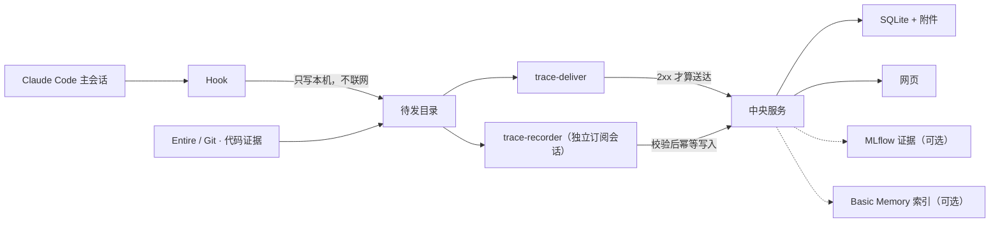

# Research Trace

科研做到一半，回头想问「这个数字当初是怎么来的」「那条路为什么放弃了」，往往只剩一堆聊天记录和一个结果文件。
Research Trace 把两件事分开保存：**完整的原始过程**自动留在服务器上随时可查，**值得长期记住的那部分**被整理成
一棵可读、可搜索、可纠正的项目记录。

它记的不只是实验：论文检索、想法讨论、对数据的理解、失败的方案、关键实现、指标、图片、产物路径和阶段性结论都算。

当前版本 **2.0.0a29**（alpha）。本机已把 hook → 投递 → Recorder → 网页整条链路跑通，并有三套可重跑的
验证脚本；真实 HPC 环境与记录质量的验收还在[待办清单](docs/TODO.md)里。

## 它是怎么工作的

前提只有一条：**不需要你记得去记录。**



一轮 Claude Code 对话结束之后：

1. **Hook**（`scripts/trace_hook.py`）已经把这一轮的每个事件和可见 transcript 增量写进本机待发目录
   `${CLAUDE_PLUGIN_DATA}/outbox/…/pending/`，隐藏推理在落盘前剥掉；对话结束（Stop）时把本轮材料封成一个 batch。
   它不联网、不启动模型，出错也不影响你的会话。
2. **投递器**（`trace-deliver`）把 `pending/` 里的文件 POST 到中央 `/api/ingest`，**只有 2xx 才搬进 `sent/`**；
   失败原样留着下次再传。上传故意不交给模型——「东西有没有存好」不该取决于模型记不记得调用一个工具。
3. **Recorder**（`trace-recorder --watch`，另行启动的后台进程）看到新 batch：向中央拉 Overview / Chapter /
   近期 Node / 人工纠正 / 相关旧记录，连同新证据组成一个 packet，用一次无状态的 `claude --print`
   （无工具、无 MCP、订阅登录）换回一份 JSON 计划。
4. Python **逐项校验**计划——来源事件、Chapter、parent、产物 URI 都必须在 packet 里出现——然后幂等写入
   Node / 产物引用 / 摘要。一条都不写是正常结果。
5. **中央服务**（`trace-server`）把语义记录和原始历史存进 SQLite；网页按 Chapter 画结构图，每条记录都能回到
   自己的来源事件。人可以确认、纠正、改章，Recorder 之后的写入不会覆盖人的版本。

可选接入：**Entire + Git** 提供阶段代码证据（[运行集成](docs/RUNTIME_INTEGRATION.md)）；**MLflow** 把已绑定实验的
run 存成带来源的证据快照，**Basic Memory** 给记录建检索索引（[框架集成](docs/INTEGRATIONS.md)）。它们都不会改写
人工确认的结论。

每一步的文件格式与目录在[格式清单](docs/FORMATS.md)；Recorder 的取舍规则在[Recorder 协议](hooks/RECORDER_PROTOCOL.md)；
它为什么是独立进程、每次调用怎么隔离、从 Claude-Mem 借鉴了什么，见[Recorder 复用方案](docs/RECORDER_REUSE_PLAN.md)。

## 三条边界

- **采集按项目 opt-in。** 只有放了 `.research-trace.json` 标记的目录会被记录；没有标记时 hook 在建任何目录之前就返回。
- **只保存可见内容。** hook 在写入前过滤隐藏推理；Entire 导入同样过滤。
- **人的判断高于 Recorder。** Recorder 建的记录一律「未确认」；人可以改、评论、纠正，Recorder 的重试覆盖不了更新的人类版本。

## 记录长什么样

```text
Project                     长期项目容器
├── Overview                当前认识、阶段结果、重要洞察与错误
├── Chapter: 主实验          人定义的并列研究线（Chapter 之间没有先后）
│   ├── Node 01             有长期价值的记录，章内按时间组织
│   └── Node 02 ─ parent → Node 01
├── Chapter: 消融实验
├── Inbox                   Recorder 无法可靠归类时的安全落点
└── Raw history             完整底层证据，默认永久保留，按需加载
```

Node 不区分「实验 / 论文 / 想法 / 实现」——都是 Node，免得 agent 先猜内容类型再决定写去哪。
Chapter 表达并列的研究线，不是流程阶段。取舍与理由见[设计理念](docs/DESIGN.md)。

## 安装

需要 Python 3.10+ 和 Claude Code。三层，缺一不可：

| 层 | 装在哪 | 装什么 |
|---|---|---|
| ① 中央服务 | 一台机器 | Python 包 + `server` extra → `trace-server` |
| ② Claude Code 插件 | 每台跑 Claude Code 的机器 | `claude plugin install` 把整个仓库拷进 `${CLAUDE_PLUGIN_ROOT}`：hook、skill、MCP 入口 |
| ③ 客户端 Python 包 | 同一台机器，装进 ② 配置里 `python` 指向的解释器 | `trace-login / trace-project / trace-deliver / trace-recorder`，以及 hook 与 MCP 进程的依赖 |

### ① 中央服务

```bash
git clone https://github.com/jinhang23/research-trace && cd research-trace
python -m pip install -e ".[server]"

# 单机试用：只听回环地址，读取公开
trace-server --data-dir /srv/research-trace/data --host 127.0.0.1 --port 8765

# 内网部署：生成一把访问密钥同时守读写，网页也用它登录
trace-server --init --data-dir /srv/research-trace/data --host 0.0.0.0
trace-server --env-file /srv/research-trace/data/server.env --host 0.0.0.0 --port 8765
```

安全分三档——单机（回环地址、读取公开）/ 内网（一把访问密钥）/ 团队（GitHub OAuth），怎么选见
[快速开始第 0 节](docs/QUICKSTART.md)。

### ② ③ 每台客户端机器

插件的 hook 和 MCP 进程都用 `${user_config.python} ${CLAUDE_PLUGIN_ROOT}/…` 直接运行，不依赖 PATH，
所以 ② 的 `python` 必须是 ③ 装进去的那个解释器——指错时 Claude Code 只会显示 `CONNECTION_CLOSED`。

```bash
# ③ 先装客户端包，记下解释器的绝对路径（conda/HPC 上尤其别用裸 python3）
python -m pip install "research-trace @ git+https://github.com/jinhang23/research-trace"
python -c "import sys; print(sys.executable)"

# ② 装插件，把 ③ 的解释器和中央地址写进插件配置
claude plugin marketplace add jinhang23/research-trace
claude plugin install research-trace@research-trace \
  --config python=/abs/path/to/python --config url=https://trace.example.org

# 自检：这个解释器装了 mcp SDK 且能连上中央（指错解释器时它会明确说）
/abs/path/to/python trace_mcp.py --selfcheck --url https://trace.example.org

# 登录：内网档粘贴访问密钥；OAuth 档在网页 /device 输入 8 位设备码
trace-login --url https://trace.example.org --token
trace-login --url https://trace.example.org --device-name my-laptop

# 绑定要记录的项目——装上插件不会记录任何东西，直到这一步
cd /path/to/my-project
trace-project bind --url https://trace.example.org --create --name "我的项目"

# 启用语义整理（先在 Claude 账户关闭 Extra usage），再在 tmux 或进程管理器里常驻一个 Recorder
trace-project recorder-enable . --model sonnet --confirm-extra-usage-disabled
trace-recorder --watch --data-dir /path/to/claude-plugin-data --url https://trace.example.org
```

不确定当前状态就跑 `trace-project status --url <地址>`，它会直接说明哪份凭据在生效、投递和 Recorder 各停在哪。
完整步骤、HPC 无头登录和远端网络检查清单见[快速开始](docs/QUICKSTART.md)。

## 日常使用

装好之后照常用 Claude Code。主 agent 多了几个 MCP 工具，插件自带的 skill 会教它什么时候用：

| 工具 | 用途 |
|---|---|
| `trace_context` | 确认项目身份，读取 Overview、Chapter 和近期上下文 |
| `trace_record` | 创建精选 Node；不能创建 Chapter，且始终未确认 |
| `trace_curate` | 修订 Overview 或 Chapter 摘要（Node 的修订走网页）|
| `trace_attach` | 保存小附件，或登记大产物的机器与路径 |
| `trace_search` | 搜索语义记录和原始历史 |
| `trace_ingest` | 手动补录原始历史；Claude Code 路径不用它 |
| `trace_login` | 使用 GitHub 账号批准当前设备 |

Recorder 自己不用这些工具。一次 batch 创建零个 Node 完全正常——目标不是「每轮都写」，而是不遗漏以后值得回看的认识。

## 数据与备份

中央数据目录是 `trace.sqlite3` 加内容寻址的 `objects/`。`trace-backup export` 导出确定性 JSONL、压缩后的
transcript、小附件和 SHA-256，**大产物只记机器、路径、大小和校验和，不复制本体**；导出树按年份和容量分卷。

```bash
trace-backup export  --data-dir <数据目录> --target <备份目录>
trace-backup verify  --source <备份目录>
trace-backup restore --source <备份目录> --data-dir <一个空目录>
```

备份格式版本为 3，**版本 2 的旧全量树仍然可以 verify 和 restore**——写入端只写当前格式，读取端永不退役。
误采集的敏感内容用 `trace-backup purge` 真删除并留下不含原文的审计记录。

## Alpha 边界

- 只适配了 Claude Code；Codex CLI / Desktop 尚未适配。
- 原始历史默认永久保存，可能含命令、路径和对话里的敏感信息。三层控制：不绑定项目、`trace-project disable`、
  `capture=off`；紧急删除见 `trace-backup purge`。
- 单机档下网页写入只算 `recorder`，不能产生 `human` 记录或确认；要 `human` 身份就用内网密钥档或 OAuth 档。
- 数据流视图的边只来自明确登记的 `sha256` / `uri` / `machine+path` 键，从不从文字推断；存量数据大多没有这个键，空图是正常状态。
- 团队配置映射目前只能通过 REST 或直接编辑配置文件维护，没有网页管理界面。

完整的需求、不变量与验收标准见[完整需求](docs/REQUIREMENTS.md)。

## 开发与验证

```bash
ruff format . && ruff check .            # 排版与静态检查（配置在 pyproject.toml）
python -m pytest -q                      # 单元/契约测试；网页渲染器的 JS 断言没装 node 就跳过
python scripts/ops_battery.py            # 运维角度 41 项，真 CLI 与假 claude，不花额度
python scripts/net_battery.py            # 服务端在远端：真 TLS、私有 CA、代理、重定向拒绝
python scripts/simulate_research.py      # 三天研究情境，8 次 sonnet 调用
```

改动**插件包**里的东西（`hooks/`、`scripts/`、`skills/`、`.claude-plugin/`、根目录 `trace_mcp.py`）之后
**必须 bump 版本号**：`claude plugin update` 按版本判断要不要重拷，版本没动，已安装的机器一个字节都拿不到。
版本只有一个来源 `research_trace/__init__.py`，两份插件清单由测试守一致。

```text
research_trace/             中央服务、存储、MCP、OAuth、备份与网页
research_trace/deliver.py   投递器 trace-deliver 与项目绑定 trace-project
research_trace/recorder.py  独立订阅 Recorder、配额状态与幂等写入
scripts/trace_hook.py       hook：本机待发目录与语义批次；不联网、不启动模型
scripts/*_battery.py …      可重跑的验证脚本，见 scripts/README.md
hooks/                      Claude Code hook 清单与 Recorder 协议
skills/research-trace/      主 agent 侧的使用说明
docs/                       设计理念、部署、完整需求、格式清单
```

## 文档

- [快速开始](docs/QUICKSTART.md) —— 安全档位、部署、登录、绑定、投递、备份
- [设计理念](docs/DESIGN.md) —— 每个取舍背后的理由
- [格式清单](docs/FORMATS.md) —— 磁盘与网络上每一种格式、目录布局、版本与兼容规则
- [Recorder 协议](hooks/RECORDER_PROTOCOL.md) —— 独立模型边界、订阅限制与记录规则
- [Recorder 复用方案](docs/RECORDER_REUSE_PLAN.md) —— 运行边界、调用顺序、从 Claude-Mem 借鉴了什么
- [验证脚本](scripts/README.md) —— 三套可重跑的真链路检查
- [完整需求](docs/REQUIREMENTS.md) —— 需求、不变量和验收标准
- [变更记录](CHANGELOG.md)

## License

[MIT](LICENSE)
