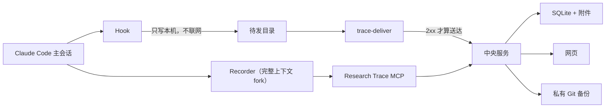

# Research Trace

科研做到一半，回头想问「这个数字当初是怎么来的」「那条路为什么放弃了」，
往往只剩一堆聊天记录和一个结果文件。Research Trace 把这两件事分开保存：
**完整的原始过程**自动留在服务器上随时可查，**值得长期记住的那部分**被整理成
一棵可读、可搜索、可纠正的项目记录。

它记的不只是实验。论文检索、想法讨论、对数据的理解、失败的方案、关键实现、指标、
图片、产物路径和阶段性结论，都是项目知识的一部分。

## 它是怎么工作的

不需要你记得去记录 —— 这是整件事的前提。四个部件各管一段：

**① Hook：把发生过的事写到本机硬盘上。**
你在 Claude Code 里正常干活。每当一件事发生（你提了个问题、跑了个命令、子任务结束），
插件里的 hook 就把它同步写进本机一个待发目录，然后立刻返回。
它**不联网**，所以网断了、服务挂了都不影响你干活，东西也不会丢。

**② 投递器：把待发目录送上中央服务。**
一个叫 `trace-deliver` 的独立进程负责上传，**只有中央确认收到（HTTP 2xx）才把文件挪进已发目录**。
失败就原样留着，下次接着传。上传这件事故意不交给模型 —— 「东西有没有存好」不该取决于
某个模型记不记得调用一个工具。

**③ Recorder：从原始过程里挑出值得记住的。**
一轮对话结束时，hook 让主 agent fork 一个后台副本。fork 会继承主 agent 此刻的完整上下文，
所以它知道刚才发生了什么。这个副本被限制成只能读、只能通过 Research Trace 的工具写，
它把这一轮里真正有价值的内容整理成记录 —— 也可能一条都不写，那是正常的。
**每一批都重新 fork**，拿的都是当下的上下文。

**④ 中央服务：存起来，给人读。**
SQLite 加内容寻址的附件目录是在线真相源，网页上能看结构图、记录、原始历史和搜索。
另外每隔一段时间导出一份确定性快照，commit 并 push 到一个**私有** Git 仓库当灾备。



三条边界值得单独记住：

- **采集是按项目 opt-in 的。** 只有放了 `.research-trace.json` 标记的目录会被记录；
  没有标记时 hook 在建任何目录之前就返回，一个字节都不写。
- **隐藏推理不出本机。** transcript 在写盘前逐行剥掉 `thinking` 块。
- **人的判断高于 Recorder。** Recorder 建的记录一律是「未确认」；人可以改、可以评论、
  可以纠正，而 Recorder 的重试覆盖不了更新的人类版本。

## 记录长什么样

```text
Project                     长期项目容器
├── Overview                当前认识、阶段结果、重要洞察与错误
├── Chapter: 主实验          人定义的并列研究线（Chapter 之间没有先后）
│   ├── Node 01             有长期价值的记录，章内按时间组织
│   └── Node 02 ─ parent → Node 01
├── Chapter: 消融实验
├── Inbox                   Recorder 无法可靠归类时的安全落点
└── Raw history             完整底层证据，默认永久保留，按需加载
```

Node 不区分「实验 / 论文 / 想法 / 实现」—— 都是 Node，免得 agent 先猜内容类型
再决定写去哪。Chapter 表达的是并列的研究线，不是流程阶段。

设计上的取舍与理由见[设计理念](docs/DESIGN.md)。

## 快速开始

需要 Python 3.10+。

```bash
git clone https://github.com/jinhang23/research-trace
cd research-trace
python -m pip install -e ".[server]"

trace-server --data-dir /srv/research-trace/data \
  --backup-repo /srv/research-trace/private-backup \
  --host 127.0.0.1 --port 8765
```

`--backup-repo` 是必填的，不给会拒绝启动；本地试用可以用 `--no-backup` 明确放弃。
团队部署要配 HTTPS 和 GitHub OAuth，见[快速开始](docs/QUICKSTART.md)。

### 客户端

```bash
# 插件提供 hook 和 MCP 工具
claude plugin marketplace add jinhang23/research-trace
claude plugin install research-trace@research-trace

# trace-login / trace-project / trace-deliver 来自 pip 包，插件不提供它们
python -m pip install "research-trace @ git+https://github.com/jinhang23/research-trace"

trace-login --url https://trace.example.org --device-name my-laptop
cd /path/to/my-project
trace-project bind --url https://trace.example.org --create --name "我的项目"
```

`trace-login` 会打印一个 8 位验证码，你在网页 `/device` 上手工输入并批准。
**装上插件不会记录任何东西，直到你对某个目录执行 `trace-project bind`。**
不确定当前状态就跑 `trace-project status --url <地址>`，它会直接说明哪份凭据在生效。

完整的部署、登录、绑定与投递说明见[快速开始](docs/QUICKSTART.md)。

## MCP 工具

Recorder 用六个研究工具，另有一个登录工具：

| 工具 | 用途 |
|---|---|
| `trace_context` | 确认项目身份，读取 Overview、Chapter 和近期上下文 |
| `trace_record` | 创建精选 Node；不能创建 Chapter，且始终未确认 |
| `trace_curate` | 修订 Overview 或 Chapter 摘要（只有这两种；Node 的修订走网页）|
| `trace_attach` | 保存小附件，或登记大产物的机器与路径 |
| `trace_search` | 搜索语义记录和原始历史 |
| `trace_ingest` | 手动补录原始历史；Claude Code 路径不用它 |
| `trace_login` | 使用 GitHub 账号批准当前设备 |

一次 batch 创建零个 Node 完全正常。目标不是「每轮都写」，而是不遗漏以后可能值得回看的认识。

## 数据与备份

中央数据目录是 `trace.sqlite3` 加内容寻址的 `objects/`。备份导出确定性 JSONL、
压缩后的 transcript、小附件、manifest 和 SHA-256；**大产物只记机器、路径、大小和校验和，
不复制本体**。导出树按年份和容量分卷，接近阈值时告警但不停止备份。

```bash
trace-backup verify  --source <备份目录>
trace-backup restore --source <备份目录> --data-dir <一个空目录>
```

备份格式版本为 3，**版本 2 的旧全量树仍然可以 verify 和 restore** —— 写入端只写当前格式，
读取端永不退役，否则一次升级就会把之前所有备份变成废纸。
误采集的敏感内容可以用 `trace-backup purge` 真删除并留下不含原文的审计记录。

## Alpha 边界

- Claude Code 的自动采集已实现；Codex CLI / Desktop 尚未适配。
- **未配置 GitHub OAuth 时读取完全公开**（含原始 transcript 与附件），启动会打印警告。
  该模式下网页写入只算 `recorder`，不能产生 `human` 记录或确认。
- 默认永久保存的原始历史可能包含命令、路径和对话中的敏感信息。三层控制：不绑定项目、
  `trace-project disable`、`capture=off`；紧急删除见 `trace-backup purge`。
- 数据流视图的边只来自明确登记的 `sha256` / `uri` / `machine+path` 键，从不从叙述文字推断。
  存量数据大多没有这个键，所以空图是正常状态。
- 团队配置映射目前只有 REST 与直接编辑配置文件两条维护路径，网页管理界面尚未实现。
- 这是 alpha；部署团队数据前请使用私有仓库、HTTPS、OAuth 白名单和独立数据目录。

完整的需求、不变量与验收标准见[完整需求](docs/REQUIREMENTS.md)。

## 开发与验证

```bash
python -m pytest -q          # 网页渲染器那套 JS 断言也会带上，没装 node 就跳过
node --test tests/md.test.js # 也可以单独跑
```

改动**插件包**里的东西（`hooks/`、`scripts/`、`skills/`、`.claude-plugin/`）之后
**必须 bump 版本号**：`claude plugin update` 按版本判断要不要重拷，版本没动就什么都不做，
已安装的机器一个字节都拿不到。版本写在六个地方，有测试守它们一致。

```text
research_trace/             中央服务、存储、MCP、OAuth、备份与网页
research_trace/deliver.py   投递器 trace-deliver 与项目绑定 trace-project
hooks/                      Claude Code Hook 清单与 Recorder 协议
scripts/trace_hook.py       本机待发目录、批次与 Recorder 调度（不联网）
skills/research-trace/      主 agent 侧的使用说明
docs/                       设计理念、部署、完整需求
```

## 文档

- [设计理念](docs/DESIGN.md) —— 每个取舍背后的理由
- [快速开始](docs/QUICKSTART.md) —— 部署、绑定、投递与登录
- [完整需求](docs/REQUIREMENTS.md) —— 需求、不变量和验收标准
- [Recorder 协议](hooks/RECORDER_PROTOCOL.md) —— 只有 Recorder fork 会读
- [变更记录](CHANGELOG.md)

## License

[MIT](LICENSE)
