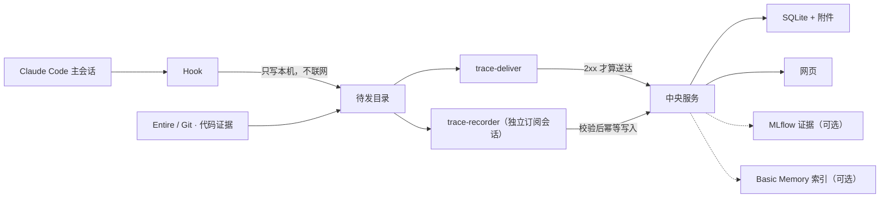

# Research Trace

科研做到一半，回头想问「这个数字当初是怎么来的」「那条路为什么放弃了」，
往往只剩一堆聊天记录和一个结果文件。Research Trace 把这两件事分开保存：
**完整的原始过程**自动留在服务器上随时可查，**值得长期记住的那部分**被整理成
一棵可读、可搜索、可纠正的项目记录。

它记的不只是实验。论文检索、想法讨论、对数据的理解、失败的方案、关键实现、指标、
图片、产物路径和阶段性结论，都是项目知识的一部分。

## 当前进度

当前实现为 **2.0.0a29**：通用框架、Entire/Git 被动取证和**独立模型增量整理（方案 3）**
已经接入。Recorder 使用 Claude Code 订阅登录，每一批只拿新增材料、简短项目背景和相关旧记录，
每次调用都是无状态的；主 agent 不再派发 fork。本机已把真 hook → 投递 → Recorder → 网页整条链路
跑通，并有三套可重跑的验证脚本（[scripts/README.md](scripts/README.md)）；真实 UF 环境与记录质量
验收见[待办清单](docs/TODO.md)，源码接缝见[Recorder 复用方案](docs/RECORDER_REUSE_PLAN.md)。

## 它是怎么工作的

不需要你记得去记录 —— 这是整件事的前提。四个部件各管一段：

**① Hook：把发生过的事写到本机硬盘上。**
你在 Claude Code 里正常干活。每当一件事发生（你提了个问题、跑了个命令、子任务结束），
插件里的 hook 就把它同步写进本机一个待发目录，然后立刻返回。
它**不联网**，网断时材料留在本机待投递；启用代码捕获后，阶段结束会保存 Git 快照。

**② 投递器：把待发目录送上中央服务。**
一个叫 `trace-deliver` 的独立进程负责上传，**只有中央确认收到（HTTP 2xx）才把文件挪进已发目录**。
失败就原样留着，下次接着传。上传这件事故意不交给模型 —— 「东西有没有存好」不该取决于
某个模型记不记得调用一个工具。

**③ Recorder：从原始过程里挑出值得记住的。**
一轮对话结束时，hook 只生成持久批次，不调用或启动任何模型。另行启动的
`trace-recorder --watch` 从 outbox 消费批次；它的 Claude 会话只有给定证据和精简项目记忆，
没有工具、MCP 或项目设置；它输出结构化计划，
Python 程序校验来源后通过现有 API 幂等写入。它也可能一条都不写，那是正常的。

**④ 中央服务：存起来，给人读。**
SQLite 加内容寻址的附件目录是在线真相源，网页上能看结构图、记录、原始历史和搜索。
代码快照和运行证据随原始记录保存；GitHub 定时备份已移除，按需保留本地导出/恢复工具。

### 一轮对话之后发生了什么

1. 你在已绑定的项目里说了话、跑了命令，**hook**（`scripts/trace_hook.py`）把每个事件和可见的
   transcript 增量原子地写进 `${CLAUDE_PLUGIN_DATA}/outbox/…/pending/`，隐藏推理在落盘前剥掉。
2. 这一轮结束（Stop）时，hook 把本轮新增材料封成一个 **batch** 清单（`batches/<id>.json`）就返回；
   它不联网、不启动任何模型，只顺手拉起一次投递器。
3. **投递器**（`trace-deliver`，`research_trace/deliver.py`）把 `pending/` 里的文件按 ≤ 6 MiB 一批
   POST 到中央 `/api/ingest`，只有 2xx 才搬进 `sent/`；失败原样留着下次再传。
4. **Recorder**（`trace-recorder --watch`，`research_trace/recorder.py`）看到新 batch：向中央拉
   Overview / Chapter / 近期 Node / 人工纠正 / 相关旧记录，组成一个 packet，用一次无状态的
   `claude --print`（无工具、无 MCP、订阅登录）换回一份 JSON 计划。
5. Python 逐项**校验**计划：来源事件、Chapter、parent、产物 URI 都必须在 packet 里出现；计划先持久化，
   再幂等写入 Node / 产物引用 / 摘要；零记录是正常结果。
6. **中央服务**（`trace-server`，`research_trace/server.py` + `storage.py`）把语义记录和原始历史存进
   SQLite，网页（`webapp.py`）按 Chapter 画结构图，每条记录都能回到它自己的来源事件；人可以
   确认、纠正、改章，Recorder 之后的写入不会覆盖人的版本。

每一步的文件格式、目录与版本在[格式清单](docs/FORMATS.md)；Recorder 的取舍规则在
[Recorder 协议](hooks/RECORDER_PROTOCOL.md)。

中央服务可选连接 **MLflow** 与 **Basic Memory**：前者把已绑定实验中的 run / trace 保存为
带来源的证据快照，后者为 Overview、Chapter 和 Node 建 hybrid 检索索引。它们都不会改写
人工确认的结论；检索命中会回到中央存储读取最新版本。配置与部署见[框架集成](docs/INTEGRATIONS.md)。

当前版本已集成 **Entire + Git、官方 MCP SDK、markdown-it、Dagre、SQLAlchemy/Alembic、Authlib**。
Entire 提供主会话与阶段代码证据。Agent 照常训练、提交 sbatch，并负责保持实验原目录和公共代码不变；
记录系统只保存观察到的命令、结果、对话与代码版本。Submitit 和实验执行管理已移除。
安装、复现命令和已验证边界见[运行集成指南](docs/RUNTIME_INTEGRATION.md)；具体替换位置见[源码复用清单](docs/SOURCE_REUSE.md)。



## 独立 Recorder 是不是一个独立 App

它是一个**独立运行的后台 worker，但不是另一套独立 App**。`trace-recorder`、投递器和中央服务
来自同一个 Research Trace Python 包，hook 来自同仓库、同版本的 Claude Code 插件；它没有自己的
网页、数据库、账号系统或常驻 HTTP 服务。这里的“独立”具体指：

| 边界 | 当前实现 |
|---|---|
| 操作系统进程 | `trace-recorder --watch` 由人或进程管理器单独启动并长期等待 outbox；hook 不创建、唤醒或管理这个进程 |
| 模型会话 | 每次调用都是全新的无状态 `claude --print --no-session-persistence`，输入就是完整 packet；不使用主 agent 的 session，不读取主 agent 完整上下文，也不续接自己的旧会话 |
| 工作目录 | 模型运行在 `${CLAUDE_PLUGIN_DATA}/recorder-workspace`，不进入研究仓库，因此不会触发项目 hook |
| 权限 | `--setting-sources ""`、`--tools ""`、空的 strict MCP 配置和 `dontAsk` 共同关闭项目设置、工具与 MCP；模型只能返回 JSON |
| 写入 | 模型不直接调用 Research Trace。Python 先校验 event、Chapter、parent、run、人工纠正和版本，再调用中央 API |
| 生命周期 | worker 可随时退出；未处理材料、模型计划和已完成写入序号都在 outbox sidecar 中，恢复不依赖模型记忆 |

一次调用的实际顺序是：

1. Stop/SessionEnd hook 把本轮新增 event 和可见 transcript 增量封成持久 batch，然后返回；即使 Recorder 没运行，batch 也留在磁盘上。
2. 单独运行的 worker 扫描 outbox。`--watch` 在空队列时继续等待；不需要常驻时也可以不带 `--watch` 只处理当前积压。
3. worker 检查项目仍启用 Recorder，并拒绝 API key、Bedrock、Vertex、Foundry、Azure 等可能转向额外计费的认证环境。
4. worker 运行 `claude auth status --json` 确认当前 Claude CLI 是 Claude 订阅/OAuth 登录；这个检查不发模型请求。旧版 CLI 没有这个子命令时预检按 `unverified` 放行，登录与否由模型调用本身判定（付费/云凭证的环境检查在此之前已经拒绝过）。
5. 调用 `claude --print --no-session-persistence ...`：每次都是无状态的全新调用，输入就是完整 packet。
6. 模型收到固定 system prompt、固定 JSON schema、新增证据、精简项目记忆和少量相关旧记录（`/api/search` 的 Node 命中），返回零个或多个 Node/摘要更新计划，可附带 `artifact_refs`（在证据里原样出现过的 W&B run、产物 URL）。
7. Python 保存计划，再逐项幂等写入 Node、产物引用和摘要；中途掉线时从 sidecar 继续，不会为了同一计划再次调用模型。
8. 空输出/格式错误/超时类失败最多重试 4 次（每次都是真实模型调用），之后批次转 `attempts_exhausted` 等操作者 `--retry-blocked`；quota 等到恢复时间；overage 永久停。

“自己的缓存”需要准确理解。Research Trace 保存的是
`${CLAUDE_PLUGIN_DATA}/outbox/recorder-status.json` 里每个项目的调用次数、模型和
`input_tokens`、`output_tokens`、`cache_read_input_tokens`、`cache_creation_input_tokens` 统计；
实际 prompt cache 由 Claude 服务管理。Research Trace
**没有实现一份本地模型缓存，也不能保证缓存一定命中或承诺节省比例**。固定的 system prompt、schema
和模型是每次调用逐字相同的前缀，这就是缓存能命中的全部条件——真链路实测无状态调用同样命中。
早期版本用 `--session-id`/`--resume` 复用一个 12 轮的会话，已经去掉：每轮都带完整 packet，续接
只会把之前每一轮的 packet 再送一遍（12 轮就能顶穿 200k 上下文），换不来任何东西。
它不会继承或复用主 agent 的 cache。即使缓存完全不命中，持久队列、幂等和人工版本保护仍然成立。

## 从 Claude-Mem 借鉴了什么

Recorder 的上游参考固定在 Claude-Mem 提交
[`be44b6c8e238a7e2bc5b3403c05afac071a59ead`](https://github.com/thedotmack/claude-mem/tree/be44b6c8e238a7e2bc5b3403c05afac071a59ead)，
许可证为 Apache-2.0。Research Trace 没有把 Claude-Mem 当作运行依赖，也没有启动它的服务；
这里的“适配”是读固定源码后，把适合本项目的逻辑重新接到现有 outbox、Node 和 Web 数据模型。

下面列出当前 Recorder 审计和借鉴过的全部 Claude-Mem 功能：

| Claude-Mem 源码 | 上游功能 | Research Trace 中的处理 |
|---|---|---|
| `plugin/modes/code.json` | 定义面向未来会话的 observer：结果既有可独立理解的事实，也有解释意义的 narrative | **已适配。** 改为研究记录语言：保留实验条件、比较、证据边界、失败、未探索方向和下一步验证；不记录 Recorder 自己的动作 |
| `src/sdk/prompts.ts` | 构造 init、observation、summary、continuation prompt；已有记忆用于续接、去重和形成连续叙事 | **已适配。** 固定 `SYSTEM_PROMPT` 加每批 packet；先比较 Overview、Chapter、近期 Node、人工纠正和相关旧记录，再决定写或成功跳过 |
| `src/cli/handlers/observation.ts` | hook 把工具事件交给后台 observer，而不是在前台同步总结 | **沿用这种职责分离。** Research Trace hook 只写本地 outbox；现有持久批次替代上游在线 worker 投递路径 |
| `src/cli/handlers/summarize.ts` | Stop 提供最后一段可见回答，允许后台形成阶段总结 | **已适配。** Stop/SessionEnd 封存从上次游标之后的可见 transcript 和事件；不阻塞主 agent，也不对每个工具调用单独生成 Node |
| `src/sdk/output-classifier.ts` | 先识别错误，再区分有效结构、空响应、普通文本、认证、限额和上下文错误 | **已适配。** `classify_cli_output` 将成功、成功零记录、empty、malformed、auth、quota、overage 和普通错误分开，避免把异常当作“没有内容值得记录” |
| `src/services/worker/RateLimitStore.ts` | 兼容不同 rate-limit event 形状，读取 reset 时间和 overage 状态，并决定暂停 | **已适配为持久状态。** 正常 `allowed` 不误判；quota 保留 batch 到恢复时间；overage 硬停止，必须人工修正账户设置后显式重试 |
| `src/services/worker/ClaudeProvider.ts` | 独立 observer provider、增量输入、模型选择、token 用量统计和会话轮换 | **适配了运行形状。** 使用官方 `claude --print`，每次调用无状态（`--no-session-persistence`），并保存 input/output/cache read/cache creation 统计；没有采用它的多 provider 凭据层，也没有采用会话轮换（见上文「自己的缓存」） |
| `src/sdk/hardened-options.ts` | observer 不加载用户设置、没有工具或 MCP，输出交给普通程序处理 | **直接映射为 CLI 隔离参数。** 空 settings、空 tools、空 MCP、`dontAsk`、独立 cwd；模型没有写数据库或运行命令的能力 |
| `src/sdk/parser.ts` | 解析宽松 XML observation、summary 和 `skip_summary` | **没有复制 XML parser。** 使用 Claude CLI `--json-schema`，再由 Python 严格验证来源 ID、结构关系和版本；零记录仍是显式 `status=skip` |
| `src/services/worker/agents/ResponseProcessor.ts` | 把解析结果连接到 Claude-Mem 的数据库、文件、广播和通知 | **只参考处理阶段划分。** 写入端改接 Research Trace 的 Node/Overview/Chapter API、幂等键和人工修订规则，没有复制其数据库耦合代码 |
| `src/services/worker/session/recycle-conversation.ts` | 上下文过大时丢弃 observer conversation，用已有 observations 重建新一代上下文，并限制连续重启 | **采用同一原则，未复制实现。** Research Trace 根本不保留 observer 对话：每次调用都从中央精选记忆重建上下文，而不是把旧完整对话塞回来 |
| `src/services/worker/retry.ts` | 按错误类别决定是否重试，rate limit 尊重恢复时间，瞬时错误指数退避 | **采用分类重试原则。** batch sidecar 保存 attempts/retry_at；认证、配置、quota、overage、网络和格式错误使用不同恢复方式；写入重放依赖幂等 |
| `src/services/worker/SessionManager.ts` | 管理每个内容会话的 observer 状态、pending 消息、累计 token 和重启状态 | **只借鉴状态边界。** Research Trace 使用每项目 session 状态和跨进程 JSON sidecar，不使用上游进程内 SessionManager |
| `src/services/worker/SessionMessageBuffer.ts` | 进程内 pending 队列与 toolUseId 去重，崩溃恢复依赖 transcript replay | **明确没有采用。** 内存队列不能满足 HPC 杀进程后的可靠性；现有磁盘 outbox、batch manifest 和中央幂等继续作为权威恢复路径 |
| `src/server/jobs/ServerJobQueue.ts` | BullMQ/Redis server job 队列，另以 PostgreSQL outbox 作为权威记录 | **明确没有采用。** 不为 Recorder 再部署 Redis/PostgreSQL，也不让它替换当前已经工作的磁盘队列 |
| `src/server/generation/providers/shared/prompt-builder.ts` | 将一组事件做隐私过滤和长度限制，构造单次 observer 请求，允许显式 skip | **适配了批量、截断和显式 skip 思路。** Research Trace 在落盘前过滤隐藏推理；Recorder packet 对单事件、transcript 和项目上下文分别设界限，并保留省略标记 |
| `src/server/generation/providers/ClaudeObservationProvider.ts` | 用 Anthropic API key 直接调用 Messages API | **明确没有采用。** 这会绕过“只用 Claude Code 订阅额度”的要求；Recorder 检测到 API/云 provider 凭据会在模型调用前停止 |

CLI 隔离还参考了 Entire CLI 固定提交
[`52207b6d2961009115f557d87aef5ff564aa810d`](https://github.com/entireio/cli/tree/52207b6d2961009115f557d87aef5ff564aa810d)
中 `generate.go` 的 `claude --print`、隔离配置与 JSON 错误处理方式。没有采用其中的 API key/helper
认证路径。上游许可证、NOTICE、逐文件接入范围和修改说明保存在
[第三方说明](THIRD_PARTY_NOTICES.md)与[Recorder 复用方案](docs/RECORDER_REUSE_PLAN.md)。

三条边界值得单独记住：

- **采集是按项目 opt-in 的。** 只有放了 `.research-trace.json` 标记的目录会被记录；
  没有标记时 hook 在建任何目录之前就返回，一个字节都不写。
- **Research Trace 仅保存可见内容。** 原始 hook 在写入 outbox 前过滤隐藏推理；Entire 导入也过滤，但 Entire 自身的本机存储遵循上游行为。
- **人的判断高于 Recorder。** Recorder 建的记录一律是「未确认」；人可以改、可以评论、
  可以纠正，而 Recorder 的重试覆盖不了更新的人类版本。

## 记录长什么样

```text
Project                     长期项目容器
├── Overview                当前认识、阶段结果、重要洞察与错误
├── Chapter: 主实验          人定义的并列研究线（Chapter 之间没有先后）
│   ├── Node 01             有长期价值的记录，章内按时间组织
│   └── Node 02 ─ parent → Node 01
├── Chapter: 消融实验
├── Inbox                   Recorder 无法可靠归类时的安全落点
└── Raw history             完整底层证据，默认永久保留，按需加载
```

Node 不区分「实验 / 论文 / 想法 / 实现」—— 都是 Node，免得 agent 先猜内容类型
再决定写去哪。Chapter 表达的是并列的研究线，不是流程阶段。

设计上的取舍与理由见[设计理念](docs/DESIGN.md)。

## 快速开始

需要 Python 3.10+。

```bash
git clone https://github.com/jinhang23/research-trace
cd research-trace
python -m pip install -e ".[server]"

# 本机试用
trace-server --data-dir /srv/research-trace/data --host 127.0.0.1 --port 8765

# 内网部署：一个访问密钥同时守读写，网页用它登录（团队/公网用 GitHub OAuth，见快速开始第 0/2 节）
trace-server --init --data-dir /srv/research-trace/data --host 0.0.0.0
trace-server --env-file /srv/research-trace/data/server.env --host 0.0.0.0 --port 8765
```

GitHub 每日备份已移除；服务无需备份配置即可启动。

### 安装到 Claude Code：三层，缺一不可

| 层 | 装在哪 | 装什么 | 命令 |
|---|---|---|---|
| ① 中央服务 | 一台机器 | Python 包 + `server` extra，`trace-server` | 上面那段 |
| ② Claude Code 插件 | 每台跑 Claude Code 的机器 | hook、skill、MCP 入口——`claude plugin install` 把**整个仓库**拷进插件目录 `${CLAUDE_PLUGIN_ROOT}` | 下面 |
| ③ 客户端 Python 包 | 同一台机器，装进 ② 的 `python` 指向的解释器 | `trace-login / trace-project / trace-deliver / trace-recorder / trace-code`，以及插件 hook 与 MCP 进程的依赖（`mcp`、`filelock`） | 下面 |

插件的 hook 和 MCP 进程都用 `${user_config.python} ${CLAUDE_PLUGIN_ROOT}/…` 直接运行，不依赖 PATH；
所以 ② 的 `python` 必须是 ③ 装进去的那个解释器——指错时 Claude Code 只会显示 `CONNECTION_CLOSED`。

```bash
# ③ 先装客户端包，记下解释器的绝对路径（conda/HPC 上尤其别用裸 python3）
python -m pip install "research-trace @ git+https://github.com/jinhang23/research-trace"
python -c "import sys; print(sys.executable)"

# ② 装插件，并把 ③ 的解释器和中央地址写进插件配置
claude plugin marketplace add jinhang23/research-trace
claude plugin install research-trace@research-trace \
  --config python=/abs/path/to/python --config url=https://trace.example.org

# 验证：这个解释器装了 mcp SDK 且能连上中央（用错解释器时它会明确说）。
# trace_mcp.py 在仓库根目录，也在插件安装目录里，两份一样
/abs/path/to/python trace_mcp.py --selfcheck --url https://trace.example.org

trace-login --url https://trace.example.org --token          # 内网档：粘贴访问密钥，一次即可
trace-login --url https://trace.example.org --device-name my-laptop   # OAuth 档：8 位设备码
cd /path/to/my-project
trace-project bind --url https://trace.example.org --create --name "我的项目"
# 先在 Claude 账户关闭 Extra usage，再启用语义整理
trace-project recorder-enable . --model sonnet --confirm-extra-usage-disabled

# 在单独的终端、tmux 或进程管理器中启动一次；之后它持续等待新 batch
trace-recorder --watch --data-dir /path/to/claude-plugin-data --url https://trace.example.org
```

`trace-login` 会打印一个 8 位验证码，你在网页 `/device` 上手工输入并批准。
**装上插件不会记录任何东西，直到你对某个目录执行 `trace-project bind`。**
不确定当前状态就跑 `trace-project status --url <地址>`，它会直接说明哪份凭据在生效。

完整的部署、登录、绑定与投递说明见[快速开始](docs/QUICKSTART.md)。

## MCP 工具

主 agent 可用六个研究工具，另有一个登录工具；独立 Recorder 不直接调用工具：

| 工具 | 用途 |
|---|---|
| `trace_context` | 确认项目身份，读取 Overview、Chapter 和近期上下文 |
| `trace_record` | 创建精选 Node；不能创建 Chapter，且始终未确认 |
| `trace_curate` | 修订 Overview 或 Chapter 摘要（只有这两种；Node 的修订走网页）|
| `trace_attach` | 保存小附件，或登记大产物的机器与路径 |
| `trace_search` | 搜索语义记录和原始历史 |
| `trace_ingest` | 手动补录原始历史；Claude Code 路径不用它 |
| `trace_login` | 使用 GitHub 账号批准当前设备 |

一次 batch 创建零个 Node 完全正常。目标不是「每轮都写」，而是不遗漏以后可能值得回看的认识。

## 数据与备份

中央数据目录是 `trace.sqlite3` 加内容寻址的 `objects/`。备份导出确定性 JSONL、
压缩后的 transcript、小附件、manifest 和 SHA-256；**大产物只记机器、路径、大小和校验和，
不复制本体**。导出树按年份和容量分卷，接近阈值时告警但不停止备份。

```bash
trace-backup verify  --source <备份目录>
trace-backup restore --source <备份目录> --data-dir <一个空目录>
```

备份格式版本为 3，**版本 2 的旧全量树仍然可以 verify 和 restore** —— 写入端只写当前格式，
读取端永不退役，否则一次升级就会把之前所有备份变成废纸。
误采集的敏感内容可以用 `trace-backup purge` 真删除并留下不含原文的审计记录。

## Alpha 边界

- Claude Code 的自动采集已实现；Codex CLI / Desktop 尚未适配。
- 安全分三档（[快速开始第 0 节](docs/QUICKSTART.md)）：单机档读取公开、只适合回环地址，对网络监听时启动会
  打印警告；内网档一把访问密钥守读写，网页输入密钥登录后的操作算 `human`；团队档 GitHub OAuth。
  单机档下网页写入只算 `recorder`，不能产生 `human` 记录或确认。
- 默认永久保存的原始历史可能包含命令、路径和对话中的敏感信息。三层控制：不绑定项目、
  `trace-project disable`、`capture=off`；紧急删除见 `trace-backup purge`。
- 数据流视图的边只来自明确登记的 `sha256` / `uri` / `machine+path` 键，从不从叙述文字推断。
  存量数据大多没有这个键，所以空图是正常状态。
- 团队配置映射目前只有 REST 与直接编辑配置文件两条维护路径，网页管理界面尚未实现。
- 这是 alpha；部署团队数据前请使用私有仓库、HTTPS、OAuth 白名单和独立数据目录。

完整的需求、不变量与验收标准见[完整需求](docs/REQUIREMENTS.md)。

## 开发与验证

```bash
python -m pytest -q          # 网页渲染器那套 JS 断言也会带上，没装 node 就跳过
node --test tests/md.test.js # 也可以单独跑
```

改动**插件包**里的东西（`hooks/`、`scripts/`、`skills/`、`.claude-plugin/`、根目录 `trace_mcp.py`）之后
**必须 bump 版本号**：`claude plugin update` 按版本判断要不要重拷，版本没动就什么都不做，
已安装的机器一个字节都拿不到。版本只有一个来源 `research_trace/__init__.py`（PEP 440），
两份插件清单写 semver 形式，有测试守它们一致；所有格式与版本的清单见[格式清单](docs/FORMATS.md)。

```bash
ruff format . && ruff check .            # 排版与静态检查（配置在 pyproject.toml）
python -m pytest -q                      # 单元/契约测试
python scripts/ops_battery.py            # 运维角度 41 项，真 CLI 与假 claude，不花额度
python scripts/simulate_research.py      # 三天研究情境，8 次 sonnet 调用
```

```text
research_trace/             中央服务、存储、MCP、OAuth、备份与网页
research_trace/deliver.py   投递器 trace-deliver 与项目绑定 trace-project
research_trace/recorder.py  独立订阅 Recorder、配额状态与幂等写入
hooks/                      Claude Code Hook 清单与 Recorder 协议
scripts/trace_hook.py       本机待发目录与语义批次；不启动模型（不联网）
scripts/*_battery.py, simulate_research.py, fake_claude.py
                            可重跑的验证脚本，见 scripts/README.md
skills/research-trace/      主 agent 侧的使用说明
docs/                       设计理念、部署、完整需求、格式清单
```

## 文档

- [设计理念](docs/DESIGN.md) —— 每个取舍背后的理由
- [格式清单](docs/FORMATS.md) —— 磁盘与网络上每一种格式、目录布局、版本与兼容规则
- [验证脚本](scripts/README.md) —— 三套可重跑的真链路检查（研究情境 / 运维 / 网络）
- [快速开始](docs/QUICKSTART.md) —— 部署、绑定、投递与登录
- [完整需求](docs/REQUIREMENTS.md) —— 需求、不变量和验收标准
- [Recorder 协议](hooks/RECORDER_PROTOCOL.md) —— 独立模型边界、订阅限制与记录规则
- [变更记录](CHANGELOG.md)

## License

[MIT](LICENSE)
