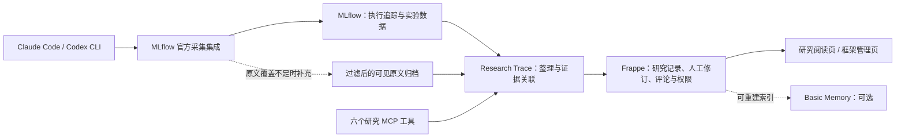

# Research Trace 框架替换审计

核查日期：2026-09-03。对象：本地 `codex/framework-integration` 开发副本，以及上游官方文档。状态：替换方案与迁移验收设计，尚未完成 Frappe 迁移或宿主采集替换。

后续状态：用户要求先完成需求访谈再选融合方案。本文是访谈前的候选分析；其中的 Frappe / MLflow 推荐与实施顺序尚未确定。用户已说明当前使用 UF HPC、SLURM 和 W&B，并放宽完整依赖图与记录粒度要求，详见 [用户需求访谈](USER_REQUIREMENTS_INTERVIEW.md)。后续选型以最新访谈为准。

访谈完成后的决定见 [融合方案](FUSION_PLAN.md)：保留现有 Web，优先验证 Entire 与 Git 的代码/会话关联，沿用 SLURM 和 W&B 指标链接，逐项替换通用组件。本文的平台级迁移建议不再是首版主线。

**结论：现有功能中，通用基础设施有很大的替换空间。后续工作的验收应包含删除被替代的实现，而不仅是增加框架适配器。**

此前 alpha.21 接通 MLflow 证据导入与 Basic Memory 检索，属于增量集成。它验证了两项连接，但保留了原有采集、投递、存储、权限、备份和 UI 基础设施。用户本轮明确要求尽可能复用，下一阶段应改变这个方向。

**保留产品需求，重新选择实现方式**

用户需要自动保留科研过程、从结论返回来源、按研究线组织精选记录、允许人确认和纠正 AI 记录，并在团队、多电脑和 HPC 场景下持续使用。以下业务语义仍需保持：

- 完整可见原始历史与精选记录分离；无价值过程可以不生成 Node。
- Project 下有 Overview 与并列 Chapter；通用 Node 的显式 parent 只能位于同一 Chapter。
- 人工修改、确认和 correction 优先于 Recorder，机器不能越权确认或覆盖人的新版本。
- 项目显式启用，跨机器有稳定项目身份；采集故障不阻断研究工作，离线内容可重放。
- 数据流边只能来自已注册的精确 artifact 身份及 input/output，不能根据文字相似度猜测。
- 六个研究 MCP 工具继续作为 Agent 的业务接口；日常阅读保留章节图与详情查看体验。

SQLite、手写 JSON-RPC、Git 分卷备份、自制 Markdown 解析器和图布局算法都是实现选择。它们不应因为已经存在而成为阻止替换的理由。既有数据、旧版本和旧备份的可读性需要迁移保障；旧服务不必永久继续运行。

**逐项替换判断**

“可替换”表示上游已有对应通用能力，不表示可不经配置、迁移或测试直接上线。“部分替换”表示需要保留明确列出的业务差异。

| 当前功能 | 建议接管者 | 判断 | 本项目剩余职责 |
| --- | --- | --- | --- |
| Claude Code 对话、工具与子 Agent 执行追踪 | MLflow 官方 Claude Code 集成 | 部分替换；优先验证 | 项目绑定、可见原文覆盖、隐藏推理在首次落盘前过滤、未完成回合覆盖 |
| Codex CLI 会话采集 | MLflow 官方 `@mlflow/codex` 集成 | 已有上游实现，无需从零开发 | 本项目 opt-in、来源标识和去重；验证 Desktop 覆盖及断网恢复 |
| 追踪数据的后台上传与重试 | MLflow 官方采集链路 | Claude Code 文档已明确提供 WAL、后台上传、重试与退出后重放 | 不把该保证自动推广到 Codex，也不把 trace 队列当成所有业务任务队列 |
| 实验参数、指标、run、trace 和执行详情 UI | MLflow | 可替换通用实现 | 研究记录与具体 run/trace/证据快照的关联；原始来源精确留存 |
| 数据表、迁移、通用 CRUD 和管理 API | Frappe DocType、Document API、REST API | 可替换通用部分 | Project/Chapter/Node 字段、关系校验、稳定 ID 与迁移映射 |
| 用户、角色、会话与项目访问控制 | Frappe 认证和权限系统 | 大部分可替换 | 项目授权配置；当前设备登录、身份绑定和机器权限的兼容适配 |
| 普通修订历史、评论、附件、管理表单 | Frappe 文档能力与 Desk | 大部分可替换 | 人工权威规则、精确历史快照、证据哈希；专用阅读体验 |
| Recorder 后台任务 | Frappe 后台队列 | 调度部分可替换 | 值得记录什么、如何归属研究线、内容去重、版本比较与 correction 处理 |
| MCP 消息协议、传输、schema 注册 | 官方 MCP Python SDK | 可替换协议基础设施 | 六个工具的实现与权限边界；固定兼容版本，必要时独立进程 |
| Markdown 解析与图布局 | markdown-it、Dagre 等现成库 | 可替换 | 来源链接、应用内跳转、节点样式和交互；实际图关系仍由业务层提供 |
| 全文与语义检索 | 框架基础检索；按需保留 Basic Memory | 可替换索引基础设施 | 搜索范围、当前版本解析、删除传播与引用回原记录 |
| 备份、保留周期与异地快照 | 数据库/框架原生备份 + restic | 可替换通用备份机制 | 旧备份导入；用户需要时保留 Markdown/JSON/Git 导出能力 |

MLflow 已记录 [Codex CLI 的逐回合采集能力](https://mlflow.org/docs/latest/genai/tracing/integrations/listing/codex/)，包括提示、回答、工具使用和会话元数据；其插件可以读取 rollout JSONL 丰富追踪。该文档不足以证明 Desktop 适配、全量原文归档或 Codex 的离线重放均满足本项目。Claude Code 的 WAL 与后台重放则在 [3.14 发布说明](https://mlflow.org/releases/3.14.0/) 中有明确描述。

Frappe 提供 [自动管理界面与 REST API](https://docs.frappe.io/framework/user/en/introduction)、[用户与权限](https://docs.frappe.io/framework/user/en/basics/users-and-permissions)、[文档保存、版本与评论接口](https://docs.frappe.io/framework/user/en/api/document)、[后台任务](https://docs.frappe.io/framework/user/en/api/background_jobs) 和 [数据库及文件备份](https://docs.frappe.io/framework/user/en/bench/reference/backup)。这些能力支持以上替换判断；它们并不会自动实现 Research Trace 的业务约束。

协议、渲染和布局可分别使用 [官方 MCP SDK](https://github.com/modelcontextprotocol/python-sdk)、[markdown-it](https://github.com/markdown-it/markdown-it)、[Dagre](https://github.com/dagrejs/dagre)。[React Flow 官方说明](https://reactflow.dev/learn/layouting/layouting)也明确布局需要另外选择算法库；不应为了替换布局而强行引入另一套前端体系。

**推荐的目标组合**

优先验证 Frappe Framework + MLflow。Research Trace 变成 Frappe 上的一款研究记录应用，而不是继续维护完整的通用服务框架。Basic Memory 保留为可选索引；没有明确召回收益时不要求部署。

MLflow 管执行过程；Frappe 管人可修订的研究知识。二者通过稳定来源 ID 和证据引用相连。不要再在 Research Trace 中完整重做 MLflow 的实验浏览器，也不要同时在两个系统里允许编辑同一份研究正文。需要独立保留的证据快照和可见原文可以作为受控文件保存，不必另建一套通用文件管理系统。

Frappe 的数据模型可以这样落地；这是本项目的设计建议，尚未实现：

| Research Trace 概念 | Frappe 上的实现 | 必须补充的规则 |
| --- | --- | --- |
| Project / Overview | Research Project DocType，含 overview 字段 | 保留旧项目 ID、机器和工作区绑定；按项目授权 |
| Chapter | Research Chapter DocType，Link 到 Project | Chapter 之间不自动推断关系 |
| Node | Research Record DocType，Link 到 Chapter，显式 parent Link | parent 同章、无环、InBox 归属；保持通用 Node |
| 人工确认与纠正 | review_state 字段、角色动作和服务端校验 | bot 不能确认、关闭 correction 或覆盖人的后续修改 |
| 修订与评论 | 框架 Version / Comment；必要时补精确 Revision 快照 | 旧作者、时间、正文和来源可核对；不能只保留导入后的单个版本 |
| 证据与附件 | File + Source Reference 元数据 | 来源 ID、SHA-256、不可变快照；不能只依赖可能失效的外链 |
| Recorder | 框架后台任务调用整理逻辑 | 幂等键、当前版本校验；已有宿主 fork/context 模式单独评估 |
| 管理与阅读 | Desk 管理数据；专用 Page 阅读章节和图 | 管理表单不能当作现有科研阅读界面的等价替代 |

普通文档版本历史不等于“人工权威”。校验必须覆盖浏览器、MCP、REST 和后台任务的所有写入路径，不能只隐藏按钮。使用框架 controller/permission hooks，避免业务写入绕过校验；[Document API](https://docs.frappe.io/framework/user/en/api/document)明确说明部分直接数据库更新接口不会执行 controller 验证。

Frappe Framework 使用 [MIT 许可证](https://docs.frappe.io/legal/others/license-and-trademark)。这里选择的是 Framework，不要求引入整套 ERPNext。代价是中央端从轻量 SQLite/Python 服务转向数据库、缓存与后台 worker 的部署；需要用实际运维环境验证，不能把代码减少等同于部署成本减少。

**为什么不直接换成一个现成产品**

| 候选 | 能接管的范围 | 对本项目的判断 |
| --- | --- | --- |
| Outline | 文档树、协作阅读编辑、评论、修订和附件 API | 如果接受以 Wiki 为主要产品形态，它能复用更多现成 UI；若保留 Chapter 图和严格 review_state，还需要配套业务层 |
| Frappe Framework | 数据模型、权限、后台任务、版本评论、表单管理、API | 更容易承载明确结构与动作约束，优先做小范围验证；专用阅读页仍需做 |
| Django | ORM、认证和管理后台 | 保守、通用的备选；评论、修订、文件体验和业务界面还需组装，不能仅换框架名字就算完成复用 |
| Directus | 数据模型、API、权限和管理台 | 技术上值得考虑；需要逐项核对当前版本的功能与许可，暂不作为默认方案 |
| MLflow 单独使用 | 实验与执行追踪、trace 评审 | 不能直接替代按研究线组织、持续编辑的人类研究记录 |

Outline 的 [开发者接口](https://www.getoutline.com/developers)覆盖多项文档能力，但 [Data Attributes](https://docs.getoutline.com/s/guide/doc/data-attributes-8nPrT7b6Qa)当前属于有版本/授权限制的功能，不能假设社区部署原生包含任意结构字段。[其当前 LICENSE](https://github.com/outline/outline/blob/main/LICENSE)也需纳入选型。Directus 的 [当前许可页](https://directus.com/license)采用 MSCL-1.0-GPL；不能继续引用早期 BSL 条款判断今天的使用条件。Django 的基础能力见 [认证系统](https://docs.djangoproject.com/en/5.2/topics/auth/) 与 [管理后台](https://docs.djangoproject.com/en/5.2/ref/contrib/admin/)。

已有 Frappe 队列时，不默认再加入 LangGraph。只有 Recorder 确实需要更复杂的跨步骤编排时，才评估 [LangGraph persistence](https://docs.langchain.com/oss/python/langgraph/persistence)。alpha.27 的独立 Recorder 已用现有持久 outbox、处理 sidecar 和幂等写入满足暂停恢复；重放不会自动执行研究动作。

本轮没有发现需要同时部署 MLflow 与另一套同职责 tracing 服务的理由，也没有发现必须同时堆叠多个长期记忆/知识图谱后端的需求。

**具体退役目标**

以下是代码阅读和维护范围的定位，不是预计可删除行数。统计口径为 PowerShell `Measure-Object -Line` 的非空行，含注释与嵌入前端代码。

| 现有文件 | 非空行 | 替换后应保留 / 退役的部分 |
| --- | ---: | --- |
| `research_trace/storage.py` | 2399 | 退役通用 sqlite3 CRUD、迁移与通用数据访问；业务校验和迁移读入器另行保留 |
| `research_trace/auth.py` | 409 | 退役框架已覆盖的会话、OAuth 和通用权限实现；设备授权兼容单独验收 |
| `research_trace/server.py` | 1282 | 收缩到业务动作与兼容 API；不长期并行维护两套 CRUD/认证权威 |
| `research_trace/webapp.py` | 4901 | 删除自制 Markdown 解析、布局及通用管理表单；保留并迁移研究阅读体验 |
| `research_trace/deliver.py` | 994 | 追踪投递被上游覆盖后删除重叠实现；原文归档及业务投递残余单独核实 |
| `research_trace/backup.py` | 978 | 通用备份交给原生备份与 restic；旧格式读入和必要导出单独保留 |
| `research_trace/mcp.py` | 686 | 保留工具语义，退役协议会话和消息处理基础设施 |
| `scripts/trace_hook.py` | 901 | 上游采集接管后收缩为项目绑定/原文差异适配，删除重复解析和追踪逻辑 |

上述文件合计 12550 非空行，但混合了产品逻辑与基础设施。没有实际迁移和删除 diff 前，不承诺“能删掉 80%”之类比例。

备份方案应先取得数据库一致性备份及所需文件，再交给 [restic](https://restic.readthedocs.io/en/stable/010_introduction.html)存储和恢复验证；不能简单复制正在写入的数据库目录。Git 可读导出与数据库灾难恢复是不同功能，按实际需要保留。

**替换顺序与完成标准**

1. **先验证两个最大的接管点。** 用隔离的 Frappe 测试站点建立 Project、Chapter、Record 与来源引用，导入合成的人工修订记录；同时用真实 MLflow 官方宿主插件验证一次可见原文覆盖和断网恢复。这样才能确认主方案，避免先完整重写前端。
2. **明确每类数据唯一写入方。** 为旧 ID、来源 ID、版本、作者、时间和证据哈希建立迁移映射。逐项比对后切换相应业务入口，旧数据库转为迁移/回滚来源。
3. **让框架接管通用管理。** 身份、权限、CRUD、附件、普通评论和管理表单交给框架，业务约束集中在 Research Trace app 内。沿用六个 MCP 工具的外部契约。
4. **迁移阅读页和薄适配。** 图关系由业务层产生，布局和 Markdown 由库处理；执行详情尽量复用 MLflow 页面/API。原文归档若确有覆盖缺口，只实现缺失部分。
5. **完成恢复验证并删除旧实现。** 导入旧备份，在新位置完整恢复并核对。每接管一个职责，就删除对应的旧运行路径、重复配置和无效测试，保留迁移所需兼容代码。

验收数据至少包括两个隔离项目、两个 Chapter、同章 parent、无归属 Inbox、人工改写过的 Node、未关闭 correction、重复批次、断网中断会话和带精确哈希的附件。它们必须证明：

- 人类编辑后，旧版本 Recorder 请求无法覆盖；bot 的确认或关闭 correction 请求被服务端拒绝，包括直接 REST 写入。
- 跨项目读取正文、附件、搜索结果及 trace 不能仅靠“知道 ID”绕过权限。
- 过滤后的可见原文在迁移前后按定义逐项/逐字核对；隐藏推理不先进入插件本地日志或远端再补删。
- 重复上传不生成重复业务记录；断网、进程退出后的持久化内容能够恢复。Claude 和 Codex 分别验证，不共用未经验证的结论。
- 每条旧修订和证据的作者、时间、内容与来源可恢复；不能只迁移当前正文。
- Chapter 和 parent 关系准确，附件哈希不变；检索命中解析到当前版本，删除内容不再返回。
- 原研究工具仍能工作；宿主上下文和 Recorder 成本变化有实测记录。
- 从备份在空白站点恢复成功，核对记录、历史、来源和权限。

这些是替换验收要求，尚未全部执行。

**目前证据的边界**

- 已实际验证：上一轮 MLflow run/trace 导入、Basic Memory 写入和检索，以及现有服务集成回归。它们证明连接可用，不能证明本报告中的完整替换已经成功。
- 已通过官方资料核实：MLflow 两类 CLI 集成、Claude Code 持久化投递；Frappe 通用应用能力；MCP、Markdown 和布局现成组件。
- 尚未验证：Frappe 数据迁移和所有写入路径的人工权威校验、上游插件的原文完整性与隐藏推理过滤、Codex Desktop 与 Codex 离线恢复、生产备份恢复、中文领域检索质量。

下一阶段应交付“可运行的框架替换样例 + 迁移核对结果 + 被删除的旧模块”，用这些结果决定接管范围。当前运行中的演示仍是 alpha.21 的原架构加集成，不能称为已经采用本报告的目标架构。
