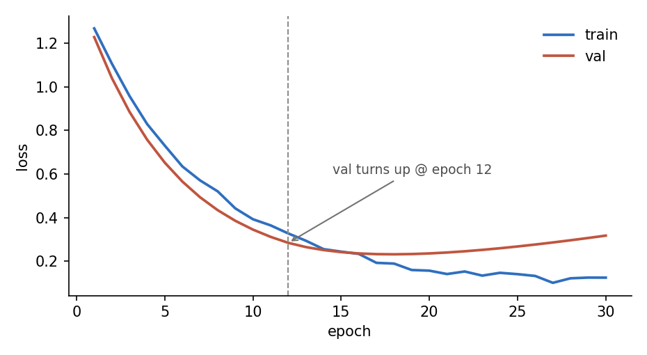

## 为什么
基线的 TF-IDF 完全丢掉词序和上下文。假设：预训练语言模型带来的上下文表征
能把这部分信息补回来，且提升幅度应当明显大于任何特征工程。

## 做了什么
- `distilbert-base-uncased` 微调 3 个 epoch，lr 2e-5，batch 32
- 只用正文字段，与基线保持一致以便公平比较

## 结果
| 模型 | 准确率 | 宏 F1 | 训练耗时 |
|---|---|---|---|
| TF-IDF + LR | 0.897 | 0.896 | 40 s |
| DistilBERT | **0.943** | **0.942** | 18 min |

## 结论
假设成立，提升 4.6 个点。代价是训练时间从 40 秒涨到 18 分钟，但对这个规模的
数据集仍然完全可接受。

## 下一步
数据里还有一个没用上的字段（标题）。先把它加进来。
